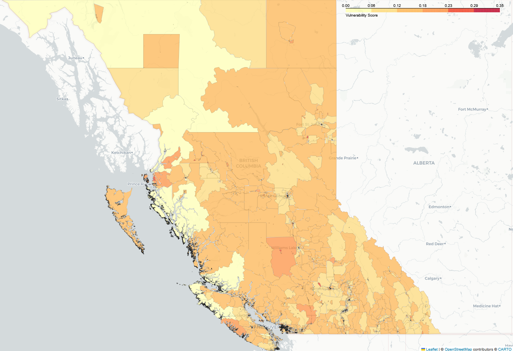
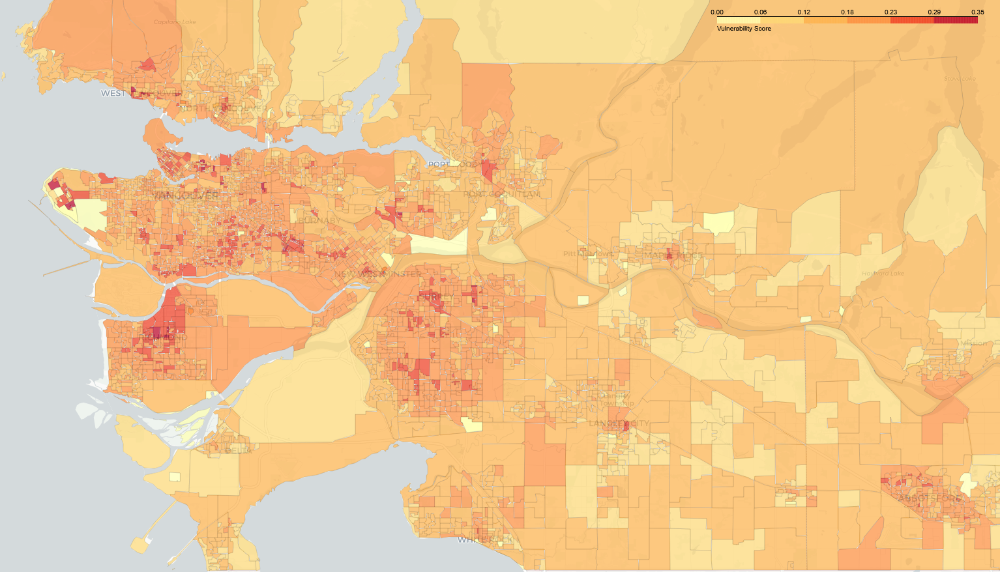
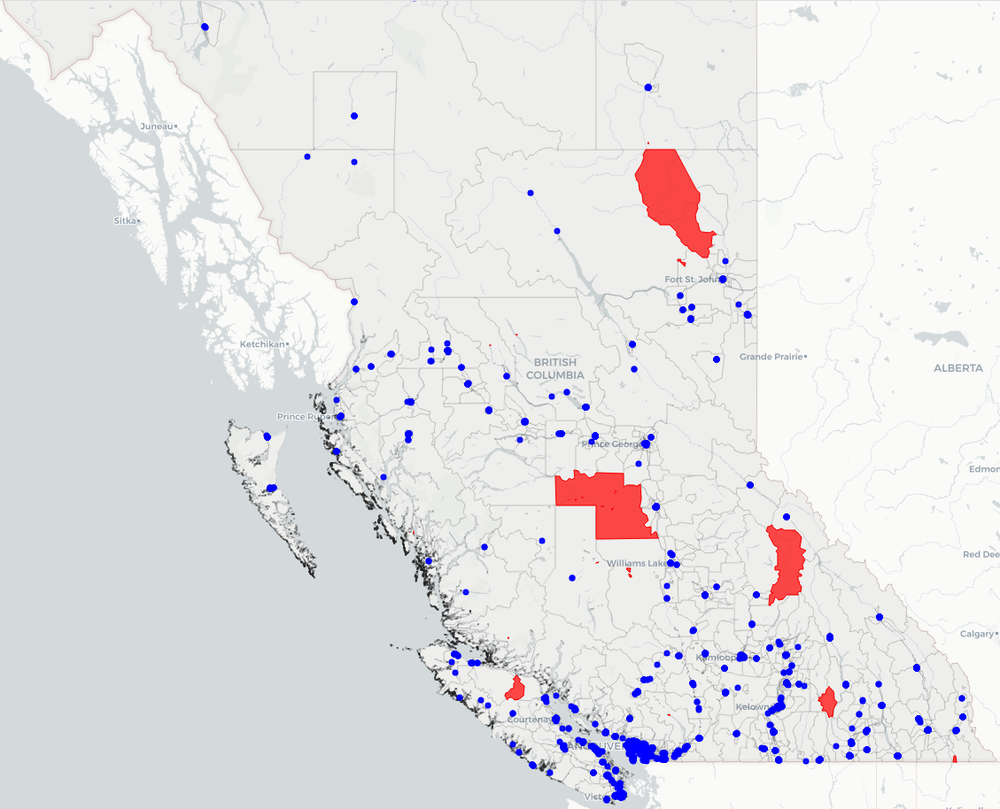
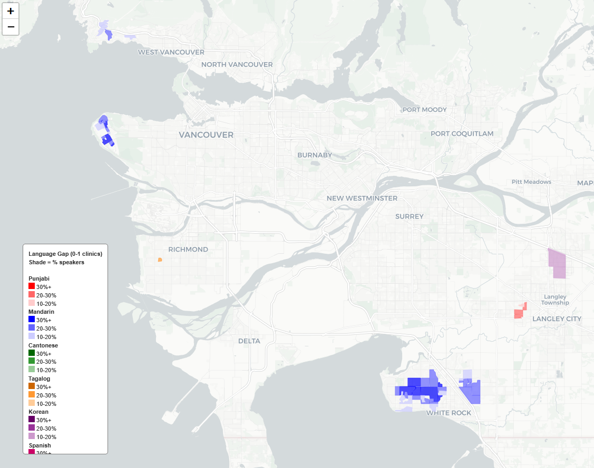
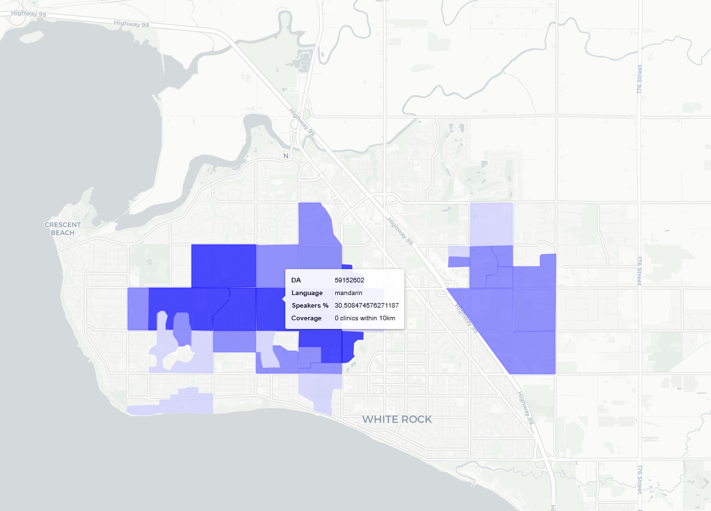
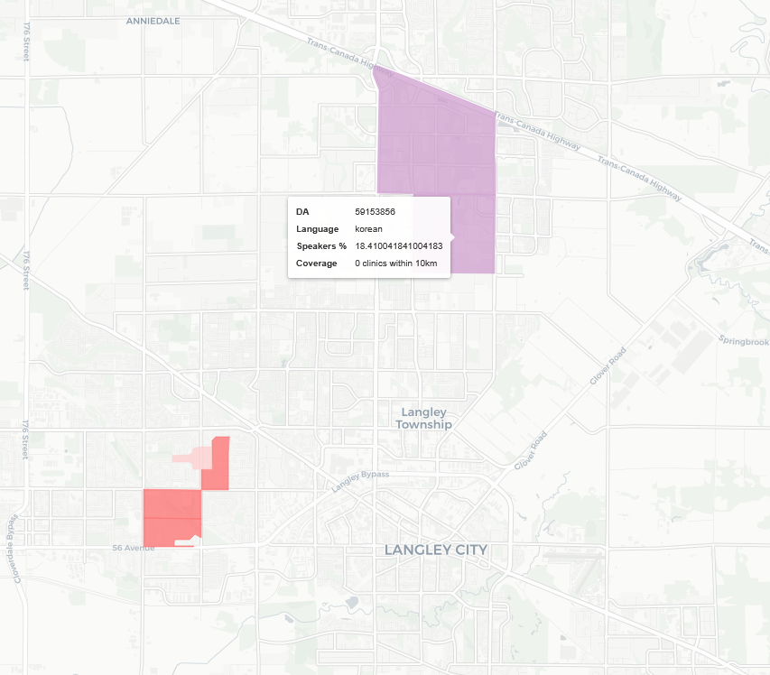
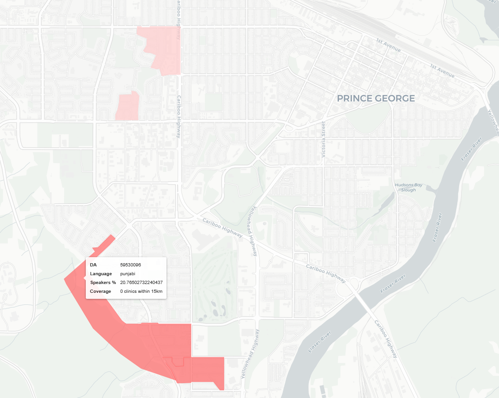
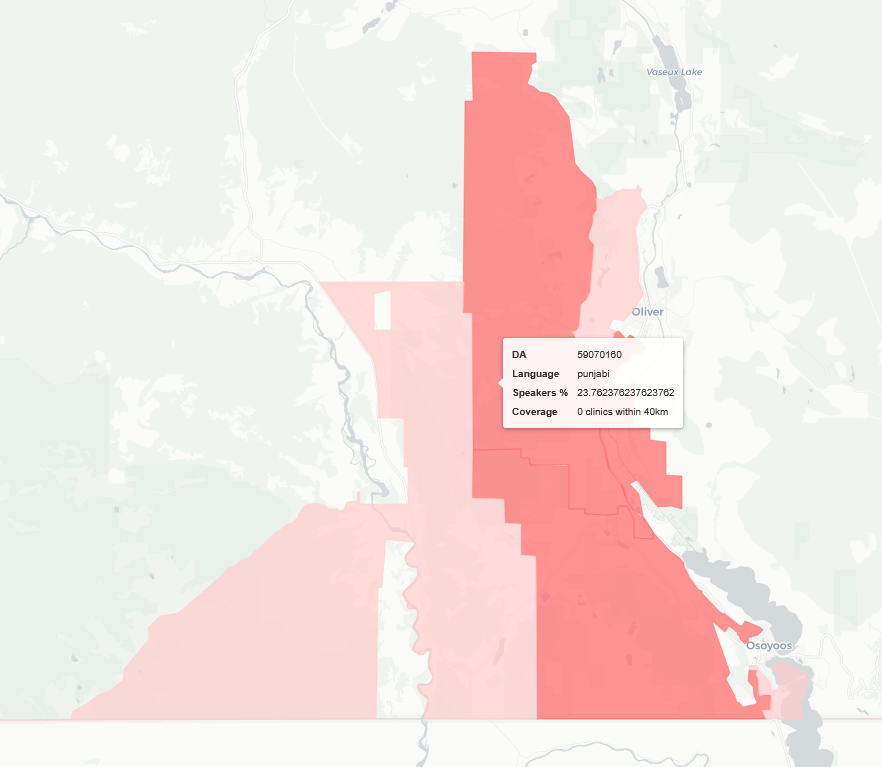

# bc_mental_health_clinics
This is a projectl looking at publicily available mental health clinic data as well as 2021 census data to improve mental health clinic availability

# Data

The data used in this project is all publicly available and open source. British Columbia does not publicise their patient health data beyond broad statistics, so I worked with census data geographic based clinic data in order to draw connections between the people these clinics are meant to serve and the accessibility of their services.

**mental-health.xlsx:** Source clinic data from HealthLink BC's Mental Health and Substance Use (MHSU) directory, downloaded from the BC Data Catalogue. Contains ~4,200 service listings across BC including service name, organization, taxonomy classification, audience, languages offered, wheelchair accessibility, address, and coordinates.

**census_da_bc_2021.xlsx:** Intermediate dataset of 2021 Census profile variables extracted at the dissemination area level for BC. Generated from the raw Statistics Canada census profile file below.

**2021_92-151_X.xlsx Statistics Canada Geographic Attribute File (2021):** Contains DA-level centroid coordinates and urban/rural population centre classification.

**98-401-X2021006_English_CSV_data_Britis...xlsx:** Raw 2021 Census Profile data for BC at the dissemination area level, downloaded from Statistics Canada. ~3.5GB — not included in repository due to size.

**lda_000b21a_e/ 2021:** Cartographic Boundary File for dissemination areas, downloaded from Statistics Canada. Shapefile format, clipped to coastline.

# Available Geographic Information

Dissemination areas are the smallest standard geographic units for which Statistics Canada publishes census data. They are geographic areas containing 400-700 people, and Statistics Canada publishes aggregate statistics about individuals living in these areas. These include things such as income, immigration status, languages spoken and age. The basic assumption of this project is that we can use this information as a substitute for more specific information about the patients who visit these clinics. But there is also a benefit to using this data: we can find out information about people who live near mental health clinics even if they do not visit them. 

The mental health clinic geographic data is used to pinpoint the location of mental health clinics in communities and compare their location to dissemination areas or DAs. I create a radius around DAs depending on their size, urban/suburban categorization, and shape, in order to find DAs that have less access than others. 

## Graphics

## Vulnerability Score

| BC Province | Metro Vancouver |
|-------------|-----------------|
|  |  |

## Highly Vulnerable DAs With Few Nearby Clinics

## DAs With Gaps in Language Coverage

| White Rock | Langley |
|-------------|-----------------|
|  |  |

| Prince George| Kelowna |
|-------------|-----------------|
|  |  |
